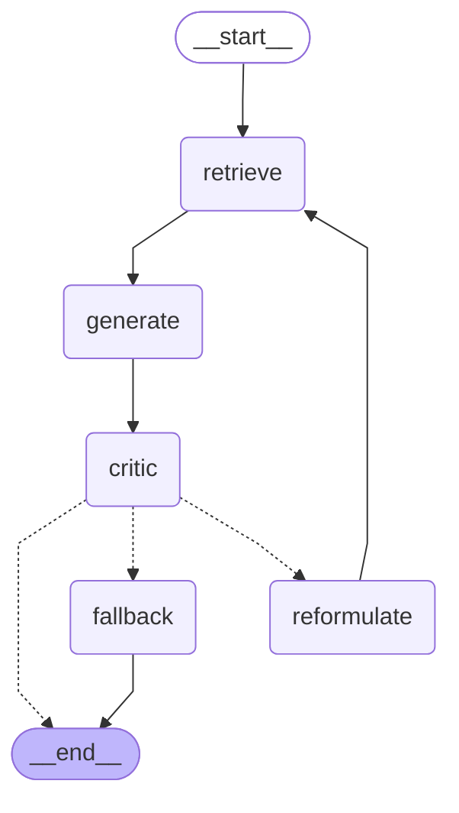

# 🛡️ Guarded RAG System

A **guarded, self-critiquing Retrieval-Augmented Generation (RAG) system** with automated evaluations — built with LangGraph, Groq, and ChromaDB.

> **Zero cost.** Runs entirely on free-tier APIs and local models.

---

## What This Project Does

This system answers questions about technical documentation with **three layers of intelligence**:

1. **Agentic RAG Core** — Retrieves relevant document chunks, generates an answer, then a *critic* checks if the answer is actually supported by the evidence. If not, it reformulates the query and tries again.
2. **Guardrails Gateway** — Input filters block PII leaks, prompt injection, and jailbreak attempts. Output filters catch toxic, off-topic, or malformed responses.
3. **Automated Eval Pipeline** — A golden dataset of 100+ Q&A pairs runs on every PR, computing hallucination rate, faithfulness, latency, and cost. Bad changes are blocked from merging.

---

## Architecture

```
User Query
   → Input Guardrails      (block PII / injection / jailbreaks)
   → Agentic RAG Core      (LangGraph: retrieve → generate → critic → retry/reformulate)
   → Output Guardrails     (schema, toxicity, on-topic checks)
   → Final Grounded Answer

Every Git Push
   → Run golden dataset (100+ Q&A pairs) through the pipeline
   → Compute hallucination rate, relevancy, faithfulness, latency
   → Gate the merge if thresholds are breached
   → Log results to a metrics dashboard
```

### RAG Flow (LangGraph)



---

## Tech Stack

| Component | Tool | Cost |
|---|---|---|
| LLM (generator) | Groq `llama-3.1-8b-instant` | Free |
| LLM (critic/judge) | Groq `llama-3.3-70b-versatile` | Free |
| LLM (offline dev) | Ollama (optional, local GPU) | Free |
| Embeddings | `sentence-transformers` `all-MiniLM-L6-v2` | Free (local) |
| Vector Store | ChromaDB | Free (local) |
| PII Detection | Presidio | Free |
| Toxicity | `unitary/toxic-bert` | Free (local) |
| CI/CD | GitHub Actions | Free |
| Dashboard | Streamlit | Free |

---

## Quick Start

### Prerequisites
- Python 3.10+
- A free [Groq API key](https://console.groq.com/keys)

### Setup

```bash
# 1. Clone the repo
git clone https://github.com/YOUR_USERNAME/guarded-rag-system.git
cd guarded-rag-system

# 2. Create virtual environment
python -m venv .venv
.venv\Scripts\activate        # Windows
# source .venv/bin/activate   # macOS/Linux

# 3. Install dependencies
pip install -e ".[dev]"

# 4. Set up environment
cp .env.example .env
# Edit .env and add your GROQ_API_KEY

# 5. Ingest documents
python scripts/ingest.py

# 6. Ask a question
python -m src.rag.graph "How do I send a POST request with JSON data?"
```

### Optional: Local LLM with Ollama

```bash
# Install Ollama: https://ollama.com/download
ollama pull llama3.1:8b-instruct-q4_K_M

# Switch to local provider
# In .env: LLM_PROVIDER=ollama
```

---

## Project Structure

```
guarded-rag-system/
├── src/
│   ├── config.py              # Settings loader
│   ├── rag/
│   │   ├── llm_provider.py    # Groq/Ollama abstraction
│   │   ├── embedder.py        # Chunking + embeddings
│   │   ├── retriever.py       # Vector search
│   │   ├── generator.py       # Answer generation
│   │   ├── critic.py          # Self-critique (70B model)
│   │   ├── reformulator.py    # Query reformulation
│   │   ├── fallback.py        # Graceful "I don't know"
│   │   └── graph.py           # LangGraph wiring
│   ├── guardrails/
│   │   ├── input_guard.py     # PII, injection, jailbreak
│   │   ├── output_guard.py    # Schema, toxicity, on-topic
│   │   └── policy_engine.py   # YAML policy loader
│   ├── eval/
│   │   ├── metrics.py         # Faithfulness, hallucination, latency
│   │   ├── runner.py          # Eval runner (smoke/full modes)
│   │   └── reporter.py        # Metrics reporting
│   └── dashboard/
│       └── app.py             # Streamlit dashboard
├── data/
│   ├── documents/             # Source docs (requests + FastAPI)
│   ├── golden_dataset.json    # 100+ eval Q&A pairs
│   └── policies.yaml          # Guardrail config
├── tests/                     # Unit + integration tests
├── scripts/                   # CLI tools
├── docs/                      # Documentation + learning journal
└── .github/workflows/         # CI/CD pipelines
```

---

## Development Status

- [x] 📁 Week 1: Project scaffold
- [ ] 🔗 Week 1: Linear RAG pipeline
- [ ] 🤖 Week 2: Agentic self-critiquing graph
- [ ] 🛡️ Week 3: Guardrails gateway
- [ ] 📊 Week 4: Golden dataset + eval harness
- [ ] ⚙️ Week 5: CI/CD automation
- [ ] 📈 Week 6: Dashboard + polish

---

## License

MIT
