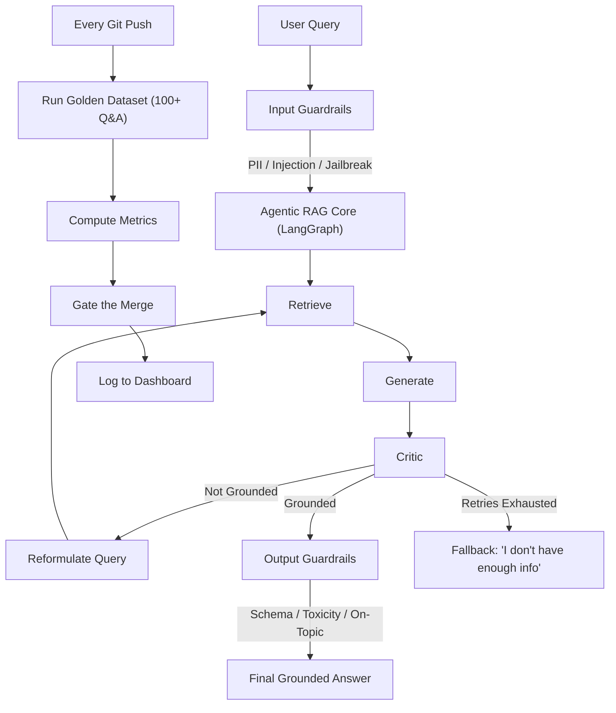

# Guarded Self-Critiquing RAG System — Implementation Plan

A detailed, day-by-day implementation plan derived from the [Combined_LLM_System_Roadmap.md](file:///c:/Users/costl/Desktop/New%20Project/Combined_LLM_System_Roadmap.md). Designed so that **every day has at least one meaningful commit** to maintain a continuous green GitHub contribution streak.

## System Architecture



---

## Tech Stack (Confirmed)

| Component | Tool | Why |
|---|---|---|
| Language | Python 3.11+ | LangChain/LangGraph ecosystem |
| Orchestration | LangGraph | Stateful, cyclical agent graphs |
| Vector Store | ChromaDB (local dev), Qdrant (prod) | Free local, scalable hosted |
| Embeddings | OpenAI `text-embedding-3-small` | Best cost/quality ratio |
| LLM | OpenAI `gpt-4o-mini` (dev), `gpt-4o` (prod) | Cost control during dev |
| Guardrails | Presidio (PII), custom classifiers, YAML policies | Open-source, extensible |
| Eval | RAGAS + custom LLM-as-judge | Industry standard |
| CI/CD | GitHub Actions | Native integration |
| Dashboard | Streamlit | Fastest to ship |
| Tracing | LangSmith (or structured JSON logs) | Built for LangChain stack |
| Package Mgmt | `uv` or `pip` + `pyproject.toml` | Modern Python packaging |

---

## Repository Structure (Target)

```
guarded-rag-system/
├── .github/
│   └── workflows/
│       ├── ci.yml                  # Lint + unit tests on every push
│       └── eval-gate.yml           # Golden dataset eval on PR
├── src/
│   ├── __init__.py
│   ├── config.py                   # Env + settings loader
│   ├── rag/
│   │   ├── __init__.py
│   │   ├── embedder.py             # Chunking + embedding logic
│   │   ├── retriever.py            # Vector store query
│   │   ├── generator.py            # LLM answer generation
│   │   ├── critic.py               # Self-critique node
│   │   ├── reformulator.py         # Query reformulation node
│   │   ├── fallback.py             # Graceful degradation
│   │   └── graph.py                # LangGraph wiring
│   ├── guardrails/
│   │   ├── __init__.py
│   │   ├── input_guard.py          # PII, injection, jailbreak
│   │   ├── output_guard.py         # Schema, toxicity, on-topic
│   │   └── policy_engine.py        # YAML policy loader
│   ├── eval/
│   │   ├── __init__.py
│   │   ├── dataset.py              # Golden dataset loader
│   │   ├── metrics.py              # Faithfulness, relevancy, etc.
│   │   ├── runner.py               # End-to-end eval runner
│   │   └── reporter.py             # Metrics reporting
│   └── dashboard/
│       ├── app.py                  # Streamlit dashboard
│       └── components/             # Dashboard widgets
├── data/
│   ├── documents/                  # Source docs for RAG
│   ├── golden_dataset.json         # 100+ Q&A eval pairs
│   └── policies.yaml               # Guardrail policy config
├── tests/
│   ├── unit/
│   ├── integration/
│   └── conftest.py
├── scripts/
│   ├── ingest.py                   # Document ingestion script
│   └── run_eval.py                 # Standalone eval runner
├── .env.example
├── .gitignore
├── pyproject.toml
├── README.md
└── CHANGELOG.md
```

---

## User Review Required

> [!IMPORTANT]
> **API Keys Needed**: You'll need an OpenAI API key (for embeddings + LLM). Optional: LangSmith API key for tracing. These should be set as environment variables and **never committed** to the repo.

> [!IMPORTANT]
> **Document Domain**: The roadmap says "pick a domain you know." What documents do you want to use for the RAG knowledge base? Options:
> - Python documentation
> - A specific book or textbook
> - Your own notes/wiki
> - Some other domain-specific docs
>
> This choice affects Week 1 and the golden dataset in Week 4.

> [!WARNING]
> **Cost Awareness**: Running 100+ eval queries through GPT-4o on every PR can get expensive. The plan uses `gpt-4o-mini` during development and switches to `gpt-4o` only for final eval runs. Estimated dev cost: ~$5-15/week.

## Open Questions

1. **Which document set** do you want to chunk and embed for the RAG knowledge base?
2. **Do you already have an OpenAI API key**, or do we need to set that up first?
3. **GitHub repo**: Should I create a new public GitHub repo, or do you have one already? What should it be named? (Suggestion: `guarded-rag-system`)
4. **Start date**: The plan below assumes we start today (July 3, 2026). Should I adjust the dates?

---

## Proposed Changes — Day-by-Day Commit Schedule

The plan is structured so **every single day has at least one commit**, giving you a solid green GitHub streak. Each day's work is scoped to be completable in 2-4 hours.

---

### Week 1 — Foundation: Basic RAG Pipeline

#### Day 1 (Thu Jul 3) — Project scaffold + repo init

##### [NEW] Project initialization
- Initialize Git repo with proper `.gitignore` (Python, IDE, `.env`)
- Create `pyproject.toml` with dependencies: `langchain`, `langchain-openai`, `chromadb`, `python-dotenv`
- Create `.env.example` with required keys
- Create `README.md` with project title, description, and architecture diagram
- Create folder structure (`src/`, `tests/`, `data/`, `scripts/`)
- **Commits**: `init: project scaffold`, `docs: add README with architecture overview`

#### Day 2 (Fri Jul 4) — Document ingestion + chunking

##### [NEW] [embedder.py](file:///c:/Users/costl/Desktop/New%20Project/src/rag/embedder.py)
- Implement document loading (PDF, Markdown, or text files)
- Recursive text splitter with configurable chunk size (500 tokens) and overlap (50 tokens)
- OpenAI embedding wrapper

##### [NEW] [ingest.py](file:///c:/Users/costl/Desktop/New%20Project/scripts/ingest.py)
- CLI script to ingest documents into ChromaDB
- **Commits**: `feat: document chunking and embedding pipeline`, `feat: ingestion CLI script`

#### Day 3 (Sat Jul 5) — Vector store + retriever

##### [NEW] [retriever.py](file:///c:/Users/costl/Desktop/New%20Project/src/rag/retriever.py)
- ChromaDB collection management (create, query, delete)
- Similarity search with configurable `top_k` (default: 5)
- Return chunks with metadata (source doc, page, score)

##### [NEW] Unit tests for retriever
- **Commits**: `feat: vector store retriever with ChromaDB`, `test: retriever unit tests`

#### Day 4 (Sun Jul 6) — Generator (LLM answer generation)

##### [NEW] [generator.py](file:///c:/Users/costl/Desktop/New%20Project/src/rag/generator.py)
- System prompt template that includes retrieved chunks as context
- Structured output with `answer` + `sources_used` fields
- Token usage tracking for cost estimation

##### [NEW] [config.py](file:///c:/Users/costl/Desktop/New%20Project/src/config.py)
- Centralized settings: model name, temperature, max tokens, chunk size, etc.
- **Commits**: `feat: LLM answer generator with context injection`, `feat: centralized config module`

#### Day 5 (Mon Jul 7) — Linear RAG chain (retrieve → generate)

##### [NEW] [graph.py](file:///c:/Users/costl/Desktop/New%20Project/src/rag/graph.py) (v1 — linear)
- Wire retriever + generator into a simple sequential chain
- CLI entry point: accept a question, return answer + source chunks
- Manual sanity check with 10-15 questions

- **Commits**: `feat: linear RAG chain (retrieve → generate)`, `test: manual sanity check results`

#### Day 6 (Tue Jul 8) — Baseline metrics + data collection

- Measure baseline latency on 15 test queries
- Document baseline results in `docs/baseline_metrics.md`
- Add sample documents to `data/documents/`
- **Commits**: `data: add sample document set`, `docs: baseline latency and quality metrics`

#### Day 7 (Wed Jul 9) — Week 1 cleanup + tests

- Add unit tests for embedder, generator
- Add integration test for the linear chain
- Code cleanup, docstrings, type hints
- **Commits**: `test: embedder and generator unit tests`, `refactor: type hints and docstrings`

---

### Week 2 — Agentic Self-Critiquing RAG (LangGraph)

#### Day 8 (Thu Jul 10) — LangGraph state definition

##### [MODIFY] [graph.py](file:///c:/Users/costl/Desktop/New%20Project/src/rag/graph.py)
- Define `RAGState` TypedDict: `query`, `reformulated_query`, `retrieved_chunks`, `answer`, `critic_verdict`, `retry_count`
- Set up LangGraph `StateGraph` skeleton with node placeholders
- **Commits**: `feat: LangGraph state schema and graph skeleton`

#### Day 9 (Fri Jul 11) — Critic node

##### [NEW] [critic.py](file:///c:/Users/costl/Desktop/New%20Project/src/rag/critic.py)
- Critic prompt: check if every claim in the answer is traceable to retrieved chunks
- Structured output: `verdict` (grounded / not_grounded / partially_grounded) + `reasoning`
- **Commits**: `feat: critic node with structured verdict`, `test: critic node unit tests`

#### Day 10 (Sat Jul 12) — Reformulator node

##### [NEW] [reformulator.py](file:///c:/Users/costl/Desktop/New%20Project/src/rag/reformulator.py)
- Takes the original query + critic reasoning → generates a better search query
- Preserves intent while targeting gaps the critic identified
- **Commits**: `feat: query reformulation node`

#### Day 11 (Sun Jul 13) — Fallback node + conditional routing

##### [NEW] [fallback.py](file:///c:/Users/costl/Desktop/New%20Project/src/rag/fallback.py)
- Returns "I don't have enough information to answer this" with the attempted chunks

##### [MODIFY] [graph.py](file:///c:/Users/costl/Desktop/New%20Project/src/rag/graph.py)
- Wire conditional edges: critic → reformulate (if not grounded & retries < max) → retrieve
- Critic → fallback (if retries exhausted)
- Critic → done (if grounded)
- **Commits**: `feat: fallback node`, `feat: conditional routing with retry logic`

#### Day 12 (Mon Jul 14) — Full agentic graph integration

##### [MODIFY] [graph.py](file:///c:/Users/costl/Desktop/New%20Project/src/rag/graph.py)
- Connect all nodes: retrieve → generate → critic → (reformulate | fallback | done)
- Add retry counter with configurable max (default: 2)
- End-to-end trace logging
- **Commits**: `feat: full agentic RAG graph with retry loop`

#### Day 13 (Tue Jul 15) — Graph tracing + visualization

- Add step-by-step trace output showing the path through the graph
- Generate graph visualization (LangGraph's built-in `.get_graph().draw_mermaid()`)
- Add to README
- **Commits**: `feat: graph execution tracing`, `docs: add graph visualization to README`

#### Day 14 (Wed Jul 16) — Week 2 testing + polish

- Integration tests: grounded query (no retry), ungrounded query (triggers retry), unanswerable query (hits fallback)
- Edge case handling: empty retrieval results, LLM errors
- **Commits**: `test: agentic graph integration tests`, `fix: edge case handling`

---

### Week 3 — Guardrails Gateway

#### Day 15 (Thu Jul 17) — Input guardrails: PII detection

##### [NEW] [input_guard.py](file:///c:/Users/costl/Desktop/New%20Project/src/guardrails/input_guard.py)
- Presidio integration for PII detection (emails, SSNs, credit cards, phone numbers)
- Configurable action: `block`, `redact`, or `warn`
- **Commits**: `feat: PII detection with Presidio`

#### Day 16 (Fri Jul 18) — Input guardrails: Injection / jailbreak detection

##### [MODIFY] [input_guard.py](file:///c:/Users/costl/Desktop/New%20Project/src/guardrails/input_guard.py)
- Regex heuristics for known injection patterns ("ignore previous instructions", "you are now", etc.)
- LLM-based classifier for subtler jailbreak attempts
- **Commits**: `feat: prompt injection and jailbreak detection`

#### Day 17 (Sat Jul 19) — Output guardrails: Schema validation

##### [NEW] [output_guard.py](file:///c:/Users/costl/Desktop/New%20Project/src/guardrails/output_guard.py)
- Pydantic model validation for structured JSON output
- Auto-retry generation on schema violation (up to 2 retries)
- **Commits**: `feat: output schema validation with Pydantic`

#### Day 18 (Sun Jul 20) — Output guardrails: Toxicity + on-topic checks

##### [MODIFY] [output_guard.py](file:///c:/Users/costl/Desktop/New%20Project/src/guardrails/output_guard.py)
- Toxicity classifier (lightweight model or LLM-as-judge)
- On-topic check against the document domain
- **Commits**: `feat: toxicity and on-topic output guards`

#### Day 19 (Mon Jul 21) — Policy engine (YAML config)

##### [NEW] [policy_engine.py](file:///c:/Users/costl/Desktop/New%20Project/src/guardrails/policy_engine.py)
##### [NEW] [policies.yaml](file:///c:/Users/costl/Desktop/New%20Project/data/policies.yaml)
- YAML loader for policy rules: `blocked_topics`, `require_citations`, `never_discuss_competitors`, etc.
- Policy → guardrail check mapping
- Non-engineers can edit YAML without touching code
- **Commits**: `feat: YAML policy engine`, `data: default policies.yaml config`

#### Day 20 (Tue Jul 22) — Wire guardrails into the RAG graph

##### [MODIFY] [graph.py](file:///c:/Users/costl/Desktop/New%20Project/src/rag/graph.py)
- Add `input_guard` node before `retrieve`
- Add `output_guard` node after critic accepts
- Both driven by `policies.yaml`
- **Commits**: `feat: integrate guardrails into RAG graph`

#### Day 21 (Wed Jul 23) — Week 3 tests + polish

- Unit tests for each guardrail
- Integration test: query with PII → blocked, injection attempt → blocked, clean query → passes
- **Commits**: `test: guardrail unit and integration tests`, `docs: update README with guardrails section`

---

### Week 4 — Golden Dataset + Eval Harness

#### Day 22 (Thu Jul 24) — Golden dataset: easy factual questions (batch 1)

##### [NEW] [golden_dataset.json](file:///c:/Users/costl/Desktop/New%20Project/data/golden_dataset.json)
- First 30 Q&A pairs: straightforward factual questions with expected answers
- Schema: `{ question, expected_answer, category, difficulty }`
- **Commits**: `data: golden dataset batch 1 — 30 factual Q&A pairs`

#### Day 23 (Fri Jul 25) — Golden dataset: ambiguous + no-answer + adversarial (batch 2)

##### [MODIFY] [golden_dataset.json](file:///c:/Users/costl/Desktop/New%20Project/data/golden_dataset.json)
- 30 ambiguous questions (multiple valid interpretations)
- 20 questions with no good answer in docs (should trigger fallback)
- 20 adversarial/injection attempts (should trigger guardrails)
- **Commits**: `data: golden dataset batch 2 — ambiguous, no-answer, adversarial`

#### Day 24 (Sat Jul 26) — Eval metrics: faithfulness + relevancy

##### [NEW] [metrics.py](file:///c:/Users/costl/Desktop/New%20Project/src/eval/metrics.py)
- Faithfulness/groundedness scorer (reuse critic logic or RAGAS)
- Answer relevancy scorer (semantic similarity to expected answer)
- **Commits**: `feat: faithfulness and relevancy eval metrics`

#### Day 25 (Sun Jul 27) — Eval metrics: hallucination rate + latency + cost

##### [MODIFY] [metrics.py](file:///c:/Users/costl/Desktop/New%20Project/src/eval/metrics.py)
- Hallucination rate: % of answers flagged not-grounded across dataset
- Latency tracking: p50 and p95 wall-clock time per query
- Cost per query: token counts × model pricing
- **Commits**: `feat: hallucination rate, latency, and cost metrics`

#### Day 26 (Mon Jul 28) — Dataset loader + eval runner

##### [NEW] [dataset.py](file:///c:/Users/costl/Desktop/New%20Project/src/eval/dataset.py)
##### [NEW] [runner.py](file:///c:/Users/costl/Desktop/New%20Project/src/eval/runner.py)
- Load golden dataset, run each query through the full pipeline
- Collect per-query results + aggregate metrics
- **Commits**: `feat: golden dataset loader`, `feat: end-to-end eval runner`

#### Day 27 (Tue Jul 29) — Metrics reporter + first full eval run

##### [NEW] [reporter.py](file:///c:/Users/costl/Desktop/New%20Project/src/eval/reporter.py)
- Console report: table of metrics with pass/fail thresholds
- JSON output for historical tracking
- Run first full eval, calibrate thresholds based on real numbers
- **Commits**: `feat: metrics reporter with threshold checks`, `data: first eval run results`

#### Day 28 (Wed Jul 30) — Week 4 cleanup + remaining Q&A pairs to 100+

- Expand golden dataset to 100+ pairs
- Test edge cases in eval runner
- **Commits**: `data: expand golden dataset to 100+ pairs`, `test: eval runner edge cases`

---

### Week 5 — CI/CD Automation

#### Day 29 (Thu Jul 31) — GitHub Actions: lint + unit tests

##### [NEW] [.github/workflows/ci.yml](file:///c:/Users/costl/Desktop/New%20Project/.github/workflows/ci.yml)
- Trigger on push to any branch
- Run `ruff` for linting, `pytest` for unit tests
- **Commits**: `ci: add lint and unit test workflow`

#### Day 30 (Fri Aug 1) — GitHub Actions: eval gate on PR

##### [NEW] [.github/workflows/eval-gate.yml](file:///c:/Users/costl/Desktop/New%20Project/.github/workflows/eval-gate.yml)
- Trigger on pull request to `main`
- Run eval script with thresholds from config
- Fail the check if any threshold breached
- **Commits**: `ci: add eval gate workflow on PR`

#### Day 31 (Sat Aug 2) — Threshold config + merge gate logic

##### [NEW] [eval_config.yaml](file:///c:/Users/costl/Desktop/New%20Project/data/eval_config.yaml)
- Configurable thresholds: `max_hallucination_rate: 0.05`, `max_p95_latency_ms: 4000`, etc.
- CI reads this config to determine pass/fail
- **Commits**: `feat: eval threshold config`, `ci: integrate threshold config into eval gate`

#### Day 32 (Sun Aug 3) — Historical results storage

- SQLite database to store eval results per commit
- Schema: `commit_hash, timestamp, hallucination_rate, relevancy_score, p50_latency, p95_latency, cost, pass_fail`
- **Commits**: `feat: SQLite eval results storage`

#### Day 33 (Mon Aug 4) — Historical query + trend output

- CLI command to query historical results
- Show trends: improving/degrading over last N commits
- **Commits**: `feat: historical eval trend query`

#### Day 34 (Tue Aug 5) — CI workflow polish + branch protection

- Add caching for dependencies in CI
- Document branch protection setup in README
- Test the full CI pipeline end-to-end
- **Commits**: `ci: add dependency caching`, `docs: CI setup and branch protection guide`

#### Day 35 (Wed Aug 6) — Week 5 testing + docs

- Test CI locally with `act` or verify on GitHub
- Update CHANGELOG.md
- **Commits**: `test: CI workflow verification`, `docs: update CHANGELOG`

---

### Week 6 — Dashboard + Polish

#### Day 36 (Thu Aug 7) — Streamlit dashboard: layout + data loading

##### [NEW] [app.py](file:///c:/Users/costl/Desktop/New%20Project/src/dashboard/app.py)
- Page layout: sidebar navigation, main content area
- Load eval results from SQLite
- **Commits**: `feat: Streamlit dashboard scaffold and data loading`

#### Day 37 (Fri Aug 8) — Dashboard: metrics charts

- Hallucination rate over time (line chart)
- Latency trend (p50/p95 area chart)
- Cost per query trend
- Pass/fail history per commit (colored table)
- **Commits**: `feat: dashboard metrics charts`

#### Day 38 (Sat Aug 9) — Dashboard: query debugger

- Select a specific eval run → see per-query results
- For each query: which guardrails fired, how many retries, critic reasoning
- **Commits**: `feat: dashboard query debugger view`

#### Day 39 (Sun Aug 10) — Pipeline tracing + structured logging

- Add structured JSON logs across the entire pipeline
- Log format: `timestamp, query_id, node, input, output, latency_ms, tokens_used`
- Optional LangSmith integration
- **Commits**: `feat: structured pipeline logging`, `feat: optional LangSmith tracing`

#### Day 40 (Mon Aug 11) — README overhaul + architecture diagram

##### [MODIFY] [README.md](file:///c:/Users/costl/Desktop/New%20Project/README.md)
- Complete README: architecture diagram, setup instructions, how to run locally
- How to add new policies, how to extend the golden dataset
- **Commits**: `docs: comprehensive README with setup guide`

#### Day 41 (Tue Aug 12) — Demo preparation + final polish

- Prepare demo scenarios: normal query, retry query, guardrail trigger, CI block
- Code cleanup, final type hints, docstrings
- Add `CONTRIBUTING.md`
- **Commits**: `docs: demo scenarios`, `refactor: final cleanup and polish`

#### Day 42 (Wed Aug 13) — Final release

- Tag `v1.0.0`
- Record demo video (2-3 min)
- Final CHANGELOG update
- **Commits**: `chore: v1.0.0 release`, `docs: final CHANGELOG`

---

## GitHub Green Streak Strategy

> [!TIP]
> **42 days of consecutive commits** = 6 full weeks of green on your GitHub contribution graph.

### Rules to maintain the streak:
1. **Every day gets at least 1 commit** — the schedule above ensures this
2. **Commits must be on the default branch** (or merged PRs) to count on the graph
3. **Use feature branches + merge PRs** for larger changes — the merge commit also counts
4. **If you finish early**, add tests, docs, or refactoring commits — they all count
5. **Commit messages follow Conventional Commits**: `feat:`, `fix:`, `test:`, `docs:`, `ci:`, `refactor:`, `data:`, `chore:`

### Git workflow:
```
main ← develop ← feature branches

feature/week1-rag-foundation
feature/week2-agentic-graph
feature/week3-guardrails
feature/week4-eval-harness
feature/week5-cicd
feature/week6-dashboard
```

Each feature branch gets merged via PR at the end of the week — giving you additional merge commits.

---

## Verification Plan

### Automated Tests
```bash
# Unit tests (run daily)
pytest tests/unit/ -v

# Integration tests (run weekly)
pytest tests/integration/ -v

# Full eval run (run on PR to main)
python scripts/run_eval.py --config data/eval_config.yaml

# Lint
ruff check src/ tests/
```

### Manual Verification
- Week 1: CLI demo — ask 15 questions, verify answers + source chunks
- Week 2: Trace a query through retrieve → generate → critic → reformulate → accept
- Week 3: Test PII query (blocked), injection (blocked), clean query (passes)
- Week 4: Inspect eval report — are thresholds reasonable?
- Week 5: Push a bad change, verify CI blocks the merge
- Week 6: Walk through dashboard, verify charts are accurate

### Milestones
| Week | Milestone | Verification |
|------|-----------|-------------|
| 1 | Linear RAG returns grounded answers | 15 manual test queries pass |
| 2 | Agentic graph with visible retry loop | Trace logs show critic → reformulate → accept path |
| 3 | Guardrails block bad input/output | PII, injection, toxicity test cases all caught |
| 4 | Eval harness produces metrics report | 100+ Q&A pairs scored, thresholds calibrated |
| 5 | CI blocks bad changes automatically | Intentionally bad PR gets red check |
| 6 | Dashboard shows trends, system is demo-ready | Live demo with all 4 scenarios works |
